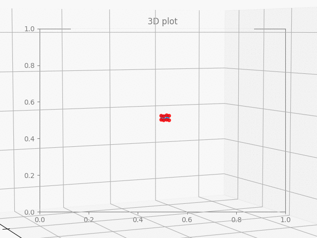
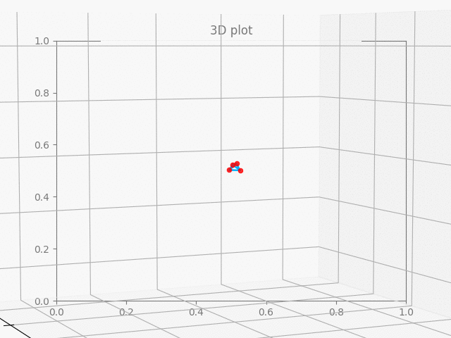
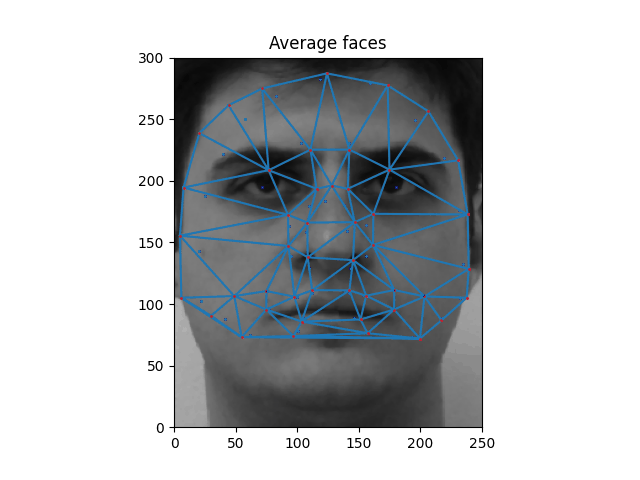
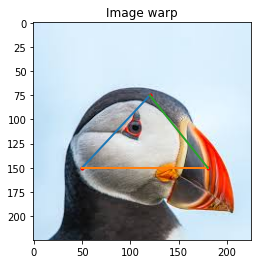
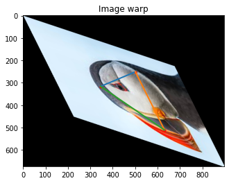

# Graphics

## Assignment2 - basic transformation of 3d graphics

> Data is given in ply file format containing verticies(vertex coordinations) and faces(edge coordinates)

   
   
Figure1. Cube resize, rotation, move position

    
   
   
Figure2. Polygon resize, rotation, move position

## Assignment3 - Morphing and Delaunay triangulation with faces

> Data given with .pts format

   
   
Figure1. First attempt, using only average vertex points

   
Used Python Delaunay from scipy.spatial package

   

      Problem1 - Edges change on morph. Needs to stay along with targeted vertices. 
      Problem2 - Y axis possibly flipped/\.
   

    

> Data given with .asf format

   
   
Figure2. Final attempt, used vector multiplication on triangle edges

   
Used Python Delaunay from scipy.spatial package for initial search

    

## Assignment4 - Affining image 

Affine contains

1. identity
2. tranlation
3. reflection
4. scale
5. rotate
6. shear

> Data given with .png image with predefine affine value

   
   
Figure1. Original image

    

   
   
Figure2. Affined image based on given affine value: [1, 3, 1, 2, 1, 1] 

    

